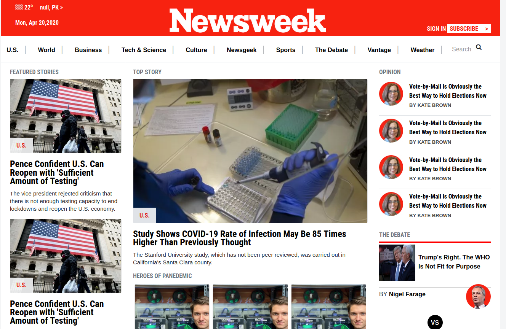
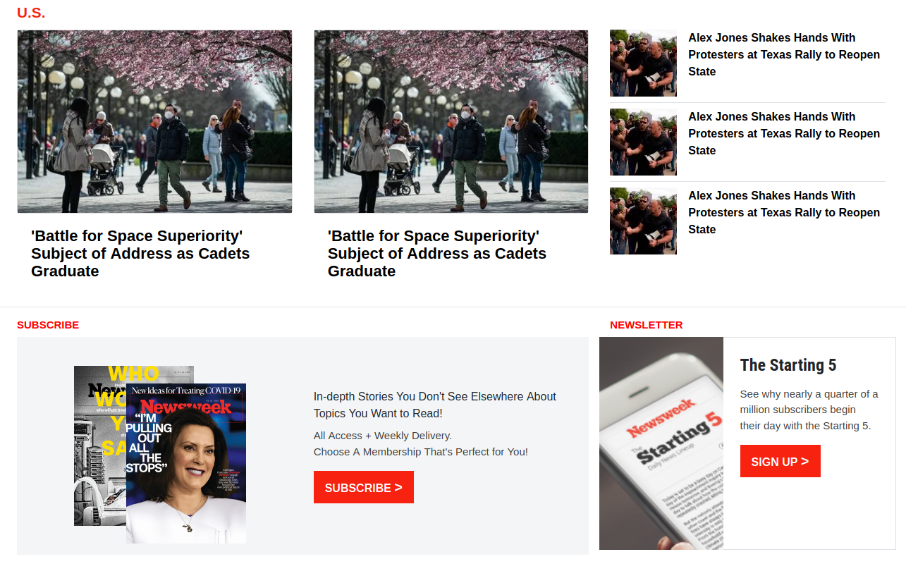
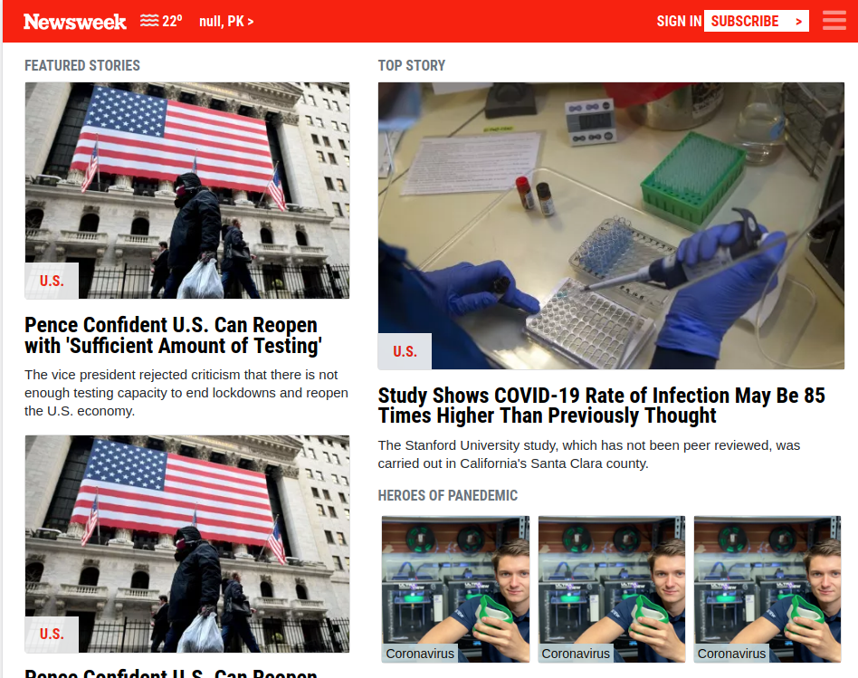
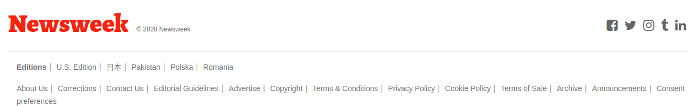

# Project Name

> Project Name NEWSWEEK CLONE This is a project based on an . In this project I used all the previous knowledge like flexbox grid float position and I also applied some new knowledge like bootstrap for this project. This website is responsive as it is build in bootstrap.

Additional description about the project and its features.

## Built With

- HTML
- CSS
- BOOTSTRAP

## Live Demo

[Live Demo Link](https://rawcdn.githack.com/MFahadUmer/NewsWeek/51ecd3941e3f51a62abd3aa762994e5dc3f6b494/index.html)

## Getting Started

**Need web browser.**

To get a local copy up and running follow these simple example steps.

### Download Repository (git@github.com:MFahadUmer/NewsWeek.git)
### cd <folder>
### run the index.html file

## Authors

👤 **Muhammad Fahad Umer**

- Github: [@MFahadUmer](https://github.com/MFahadUmer)
- Twitter: [@engfahadumer](https://twitter.com/engfahadumer)
- Linkedin: [linkedin](https://www.linkedin.com/in/engineer-muhammad-fahad-e-umer-08813055/)

## 🤝 Contributing

Contributions, issues and feature requests are welcome!

Feel free to check the [issues page](git@github.com:MFahadUmer/NewsWeek.git).

## Show your support

Give a ⭐️ if you like this project!
https://rawcdn.githack.com/MFahadUmer/apple/43bd5137a93cdae5283279fe5eeae2f008a8bc00/index.html
## Acknowledgments

- Hat tip to anyone whose code was used
- Inspiration
- etc

